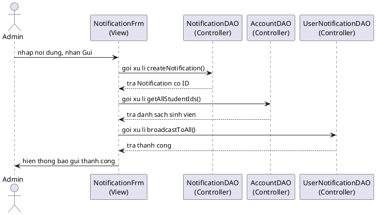

# Thiet ke chi tiet module (format giao trinh CNPM)

> Bám `CONTEXT_FOR_AI.md` mục 5–6. Mô tả động dùng ngôn ngữ **"gọi xử lí", "trả kết quả"** — không ghi `actionPerformed()` trong văn bản mô tả.

---

## Module a — Đăng nhập

### Thiết kế tĩnh

| Tầng | Lớp |
|------|-----|
| View | `LoginFrm` — form email/mật khẩu |
| DAO | `AccountDAO` — `login()` |
| Model | `Account` |

### Mô tả tuần tự

1. Người dùng nhập email, mật khẩu và nhấn Đăng nhập trên `LoginFrm`.
2. `LoginFrm` gọi xử lí `login()` của `AccountDAO`.
3. `AccountDAO` truy xuất CSDL, gọi `Account` đóng gói kết quả.
4. `Account` trả đối tượng về `AccountDAO`.
5. Nếu sai: `AccountDAO` trả null → `LoginFrm` hiển thị lỗi.
6. Nếu `status=banned`: hiển thị tài khoản bị khóa.
7. Nếu đúng: lưu session, gọi `HomeAdminFrm` hoặc `HomeStudentFrm` theo `role`.

---

## Module b — Quản lý tài khoản (Admin)

### Thiết kế tĩnh

| Tầng | Lớp |
|------|-----|
| View | `HomeAdminFrm`, `ManageAccountFrm`, `ConfirmBlockFrm` |
| DAO | `AccountDAO` — `searchAccounts`, `banAccount`, `unbanAccount` |
| Model | `Account` |

### Mô tả tuần tự (khóa tài khoản)

1. Admin mở Quản lý tài khoản từ `HomeAdminFrm`.
2. `ManageAccountFrm` gọi xử lí `searchAccounts()` của `AccountDAO`.
3. Admin nhập email/tên, nhấn Tìm kiếm → lặp bước 2.
4. Admin nhấn Khóa tài khoản → `ManageAccountFrm` gọi `ConfirmBlockFrm`.
5. Admin nhập lý do, nhấn Xác nhận.
6. `ConfirmBlockFrm` gọi xử lí `banAccount()` của `AccountDAO`.
7. `AccountDAO` cập nhật CSDL, trả kết quả → thông báo thành công.

---

## Module c — Đăng bài (Sinh viên)

| View | `CreatePostFrm` |
| DAO | `PostDAO.createPost()`, `ImageDAO`, `CategoryDAO` |
| Model | `Post`, `Image`, `Category`, `Account` |

1. Sinh viên nhập tiêu đề, mô tả, giá, danh mục, chọn ảnh.
2. `CreatePostFrm` gọi `Post` đóng gói dữ liệu form.
3. Gọi xử lí `createPost()` của `PostDAO` (kèm danh sách `imageUrl`).
4. `PostDAO` insert `tblPost`, `ImageDAO` insert `tblImage`.
5. Trả kết quả → thông báo đăng bài thành công.

---

## Module d — Tìm kiếm bài đăng

| View | `SearchPostFrm` |
| DAO | `PostDAO.searchPosts()` |
| Model | `Post` |

1. Người dùng nhập từ khóa/chọn danh mục, nhấn Tìm kiếm.
2. `SearchPostFrm` gọi xử lí `searchPosts()` của `PostDAO`.
3. `PostDAO` truy vấn CSDL, đóng gói danh sách `Post`.
4. Hiển thị bảng kết quả; double-click mở module e.

---

## Module e — Xem chi tiết bài đăng

| View | `PostDetailFrm` |
| DAO | `PostDAO.getPostById()` |
| Model | `Post`, `Image`, `Account` |

1. `PostDetailFrm` gọi xử lí `getPostById()`.
2. Hiển thị đầy đủ thông tin; sinh viên có thể gọi module f (Nhắn tin) hoặc g (Báo cáo).

---

## Module f — Nhắn tin

| View | `ChatListFrm`, `ChatRoomFrm` |
| DAO | `ChatRoomDAO`, `ChatRoomMemberDAO`, `MessageDAO` |
| Model | `ChatRoom`, `ChatRoomMember`, `Message`, `Account` |

1. Từ chi tiết bài đăng: `PostDetailFrm` gọi `ChatRoomFrm` với người bán.
2. `ChatRoomDAO` gọi xử lí `findOrCreateRoom()` (2 thành viên).
3. `ChatRoomFrm` gọi `getMessagesByRoom()` hiển thị lịch sử.
4. Gửi tin: gọi `sendMessage()` của `MessageDAO`.

---

## Module g — Báo cáo vi phạm

| View | `ReportFrm` |
| DAO | `ReportDAO`, `ReportEvidenceDAO` |
| Model | `Report`, `ReportEvidence` |

1. Sinh viên nhập lý do trên `ReportFrm`.
2. Gọi `Report` đóng gói, gọi xử lí `createReport()` của `ReportDAO`.
3. Lưu `tblReport`, `tblReportEvidence` → thông báo thành công.

---

## Module h — Duyệt báo cáo (Admin)

| View | `ManageReportFrm`, `ReportDetailFrm` |
| DAO | `ReportDAO`, `PostDAO`, `AccountDAO` |

1. `ManageReportFrm` gọi `getPendingReports()`.
2. Xem chi tiết: `getReportById()` + bằng chứng.
3. Xóa bài: `PostDAO.hidePost()` + `ReportDAO.updateStatus(resolved)`.
4. Khóa TK / Bác bỏ: tương ứng `banAccount()` hoặc `rejected`.

---

## Module i — Xem thống kê

| View | `StatDashboardFrm`, `ExportReportFrm` |
| DAO | `AccountStatDAO`, `PostStatDAO` |
| Model | `AccountStat`, `PostStat` |

Theo `Phan_IV_Thiet_Ke_Final.md`: khởi tạo dashboard gọi `getAccountStat()` và `getPostStat()`; xuất CSV qua `exportReport()`.

---

## Module k — Gửi thông báo

| View | `NotificationFrm`, `ConfirmSendFrm` |
| DAO | `NotificationDAO`, `AccountDAO`, `UserNotificationDAO` |
| Model | `Notification`, `UserNotification`, `Account` |

1. Admin soạn trên `NotificationFrm`, nhấn Gửi.
2. Gọi `Notification` đóng gói → `ConfirmSendFrm` xác nhận.
3. `createNotification()` → `getAllStudentIds()` → `broadcastToAll()`.
4. Tab lịch sử: `getNotificationHistory()`.

---

## PlantUML mẫu (module k)

